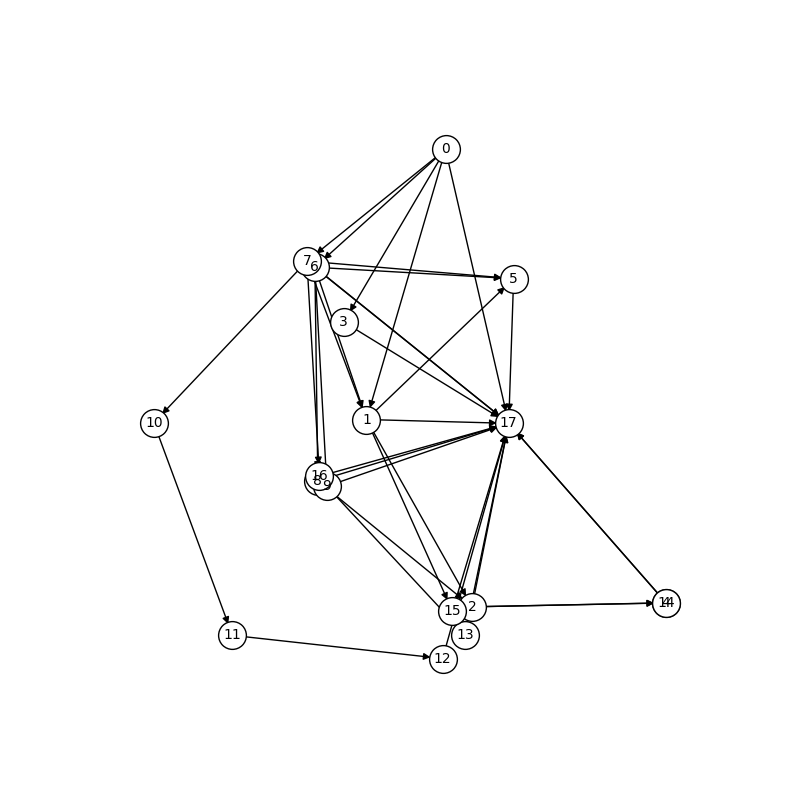

# Structure Extraction in Task-Oriented Dialogues with Slot Clustering

This is the official code repository for the paper [Structure Extraction in Task-Oriented Dialogues with Slot Clustering](https://arxiv.org/abs/2203.00073) by [Liang Qiu](https://www.lqiu.info/), [Chien-Sheng Wu](https://jasonwu0731.github.io/), [Wenhao Liu](https://twitter.com/owenhaoliu) and [Caiming Xiong](http://cmxiong.com/).

## Table of Contents

- [Abstract](#Abstract)
- [Installation](#Installation)
- [Usage](#Usage)
- [Example](#Example)
- [Citation](#Citation)
- [Contact](#Contact)
- [License](#License)

## Abstract

Extracting structure information from dialogue data can help us better understand user and system behaviors. In task-oriented dialogues, dialogue structure has often been considered as transition graphs among dialogue states. However, annotating dialogue states manually is expensive and time-consuming. In this [paper](https://arxiv.org/abs/2203.00073), we propose a simple yet effective approach for structure extraction in task-oriented dialogues. We first detect and cluster possible slot tokens with a pre-trained model to approximate dialogue ontology for a target domain. Then we track the status of each identified token group and derive a state transition structure. Empirical results show that our approach outperforms unsupervised baseline models by far in dialogue structure extraction. In addition, we show that data augmentation based on extracted structures enriches the surface formats of training data and can achieve a significant performance boost in dialogue response generation.

## Installation

**Note**: all commands below are executed from the upper-level directory containing `dialog-flow-extraction`.

### Dataset ([MultiWOZ](https://github.com/budzianowski/multiwoz))

```bash
cd dialog-flow-extraction/data
unzip MultiWOZ_2.1.zip
```

### Prerequiste

```bash
pip install -r requirements.txt
python -m spacy download en_core_web_sm

# data preprocessing
python dialog-flow-extraction/process.py
```

## Usage

### Baseline Models

- Random

```bash
python dialog-flow-extraction/random_baseline.py
```

- VRNN & SVRNN

Refer to https://github.com/Liang-Qiu/SVRNN-dialogues/.

- BERT-KMeans/Birch/Agg

```bash
python dialog-flow-extraction/bert.py -c 'kmeans'/'birch'/'agg' --bert-config 'bert-base-uncased'
```

- TOD-BERT-mlm/jnt

```bash
python dialog-flow-extraction/bert.py --bert-config 'TODBERT/TOD-BERT-MLM-V1'/'TODBERT/TOD-BERT-JNT-V1'
```

- (TOD-)BERT-spaCy

```bash
python dialog-flow-extraction/bert_spacy.py --bert-config 'bert-base-uncased'/'TODBERT/TOD-BERT-JNT-V1'
```

### TOD-BERT-DET

- Training

```bash
# 1. train SBD 
python dialog-flow-extraction/train_sbd.py --do_train --do_eval --model_dir dialog-flow-extraction/out/todbert_sbd_{test_domain} --test_domain {test_domain}
# 2. inference
python dialog-flow-extraction/bert_sbd.py --model_dir dialog-flow-extraction/out/todbert_sbd_{test_domain} --test_domain {test_domain}
```

- Download Pre-trained Models

https://drive.google.com/file/d/1jspaG9fFvWpq0MZ-MNlvzRUHLBjc_FrE/view?usp=sharing

- Evaluation

1. Structure extraction: evaluated during training.
2. Response generation (data augmentation):

```bash
# Multi-Response Data Augmentation (MRDA)
python dialog-flow-extraction/generation.py --augment --test_domain {test_domain} --train_ratio {train_ratio} --aug_ratio {aug_ratio}
# Most Frequent Sampling (MFS)
python dialog-flow-extraction/generation.py --mfs --test_domain {test_domain} --train_ratio {train_ratio} --aug_ratio {aug_ratio}
```

### Causality Detection (beta)

```bash
python dialog-flow-extraction/causality.py
```

## Example

Extracted Structure from the MultiWoz `Attraction` domain:


## Citation

```
@article{qiu2022structure,
  title={Structure Extraction in Task-Oriented Dialogues with Slot Clustering},
  author={Qiu, Liang and Wu, Chien-Sheng and Liu, Wenhao and Xiong, Caiming},
  journal={arXiv preprint arXiv:2203.00073},
  year={2022}
}
```

## Contact

For any questions, feel free to open issues, or shoot emails to

- Liang Qiu (liangqiu@ucla.edu or liangqiu@outlook.com)
- Chien-Sheng Wu (wu.jason@salesforce.com)

## License

The code is released under BSD 3-Clause - see [LICENSE](LICENSE.txt) for details.
